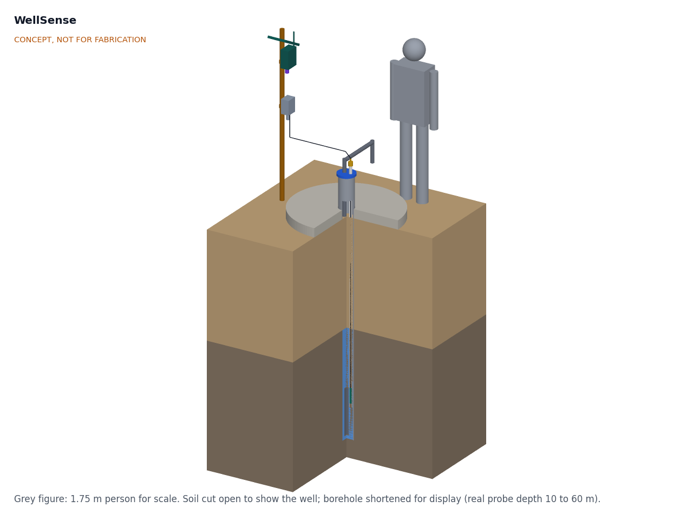
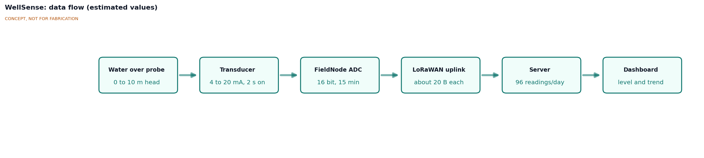
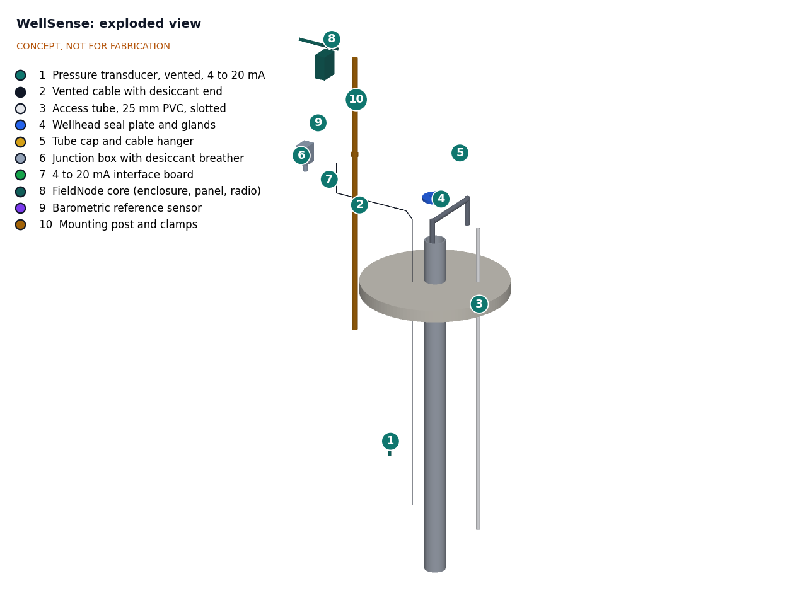
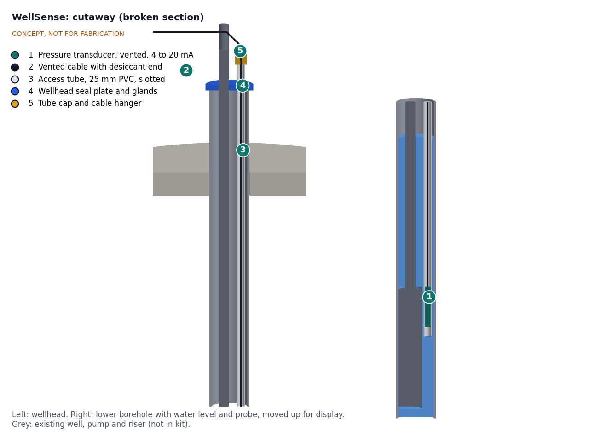

# WellSense design precis

## Summary

WellSense hangs a vented submersible pressure transducer in its own access tube inside an existing well and reads it every 15 minutes through the lab's shared FieldNode core, which sends the level over LoRaWAN to an open community dashboard. On first-order estimates it resolves about 0.5 mm, uses under 1 % of FieldNode's sensor energy budget, and costs about $170 in parts per well plus the FieldNode core. Accuracy before field calibration (about ±50 mm) does not yet meet the ±20 mm target. Every choice below is proposed, awaiting Amish.

Figure 1. Concept massing model in a borehole with a pump and riser, soil cut open, 1.75 m person for scale. The borehole is shortened for display. CONCEPT, NOT FOR FABRICATION.

## How it works

1. **Sense.** The transducer measures the pressure of the water column above it. Its cable carries a capillary vent tube to the surface, so the sensor reads gauge pressure and air pressure changes cancel out. Water above the probe is h = p / (ρg), about 102 mm per kPa.
2. **Keep clear of the pump.** The probe hangs at a recorded depth inside a 25 mm PVC access tube, slotted at the bottom, so it cannot tangle with the pump cable or riser and can be pulled for checks without touching the pump.
3. **Seal the wellhead.** A split seal plate replaces or supplements the existing well cap, with glands for the riser and access tube. The cable leaves the tube through a cap with a cable-grip hanger.
4. **Read.** FieldNode switches its 12 V rail on for about 2 s every 15 min. The 4 to 20 mA loop current develops 0.6 to 3.0 V across a 150 Ω precision shunt, read by a 16-bit ADC. A barometric sensor under the node logs air pressure.
5. **Convert and send.** Firmware converts current to water above the probe, then to depth to water below the measuring point: depth = probe depth below the measuring point minus water above the probe. FieldNode stores each reading and sends it in a short LoRaWAN uplink.
6. **Show.** An open dashboard plots level below ground, daily pumping drawdown and recovery, and the change against the same month last year. The community owns the data and can export CSV.
7. **Check.** At installation and each quarterly visit a caretaker measures depth to water with a manual electric tape, as in USGS procedures ([Cunningham and Schalk, 2011](https://pubs.usgs.gov/tm/1a1/)), and the offset is recorded to correct drift.

Figure 2. Data flow from probe to dashboard. Values are estimates.

## Main components

Table 1. Main components, numbered as in the BOM and the exploded view.

| # | Component | Proposed choice | Notes |
| --- | --- | --- | --- |
| 1 | Pressure transducer | Vented 4 to 20 mA, 0 to 10 m, 316 stainless, about 24 mm diameter, IP68 | Range and type proposed, awaiting Amish |
| 2 | Vented cable | PU or PE jacket with strain member and vent capillary, about 7 mm | Length per well, to 60 m |
| 3 | Access tube | 25 mm (1 in) PVC, slotted at the bottom | Only where a pump or riser shares the casing |
| 4 | Wellhead seal plate | Split plate with EPDM gasket and two glands, for 150 mm casing | Keeps surface water and insects out |
| 5 | Tube cap and hanger | PVC cap with cable grip | Sets and records probe depth |
| 6 | Junction box | IP66 box with silica gel breather on the vent tube | Desiccant changed every visit |
| 7 | Interface board | 150 Ω 0.1 % shunt, 16-bit ADC, TVS surge protection | Off-the-shelf modules, no custom PCB |
| 8 | FieldNode core | Lab shared node: enclosure, 6 W panel, LiFePO4 cell, LoRaWAN radio | See the FieldNode repo |
| 9 | Barometric sensor | BMP390 or BME280 class, in a vented housing | Aquifer air pressure response; vent check |
| 10 | Mounting post | 48 mm galvanized pole, 2.35 m, set in concrete beside the apron | Band clamps |

Figure 3. Exploded view with BOM callouts. CONCEPT, NOT FOR FABRICATION.

Figure 4. Broken section: wellhead (left) and lower borehole with water level and probe (right).

## First-order numbers

All values are estimates for concept review and will be checked at TRL 3.

Table 2. First-order estimates.

| Quantity | Estimate | Basis | Requirement |
| --- | --- | --- | --- |
| Full-scale pressure | 98 kPa | 10 m × 1,000 kg/m³ × 9.81 m/s² | R1 |
| Resolution | about 0.5 mm | 16 mA span × 150 Ω = 2.4 V; ADC step 125 µV at ±4.096 V gives about 19,200 steps over 10 m | R3 met |
| Datasheet accuracy | about ±50 mm | 0.5 % of 10 m full scale | R4 (±20 mm) not met |
| Accuracy with a 0.25 % sensor | about ±25 mm | 0.25 % of 10 m | R4 still not met without field calibration |
| Density error if uncorrected | up to about 30 mm | 0.3 % density change, 4 to 25 °C, at 10 m | Corrected in firmware |
| Error if absolute sensor were used without compensation | up to about ±300 mm | Weather swings of about ±3 kPa in air pressure | Reason for the vented design |
| Energy per reading | about 0.66 J | 12 V × 22 mA × 2 s, 80 % boost efficiency | |
| Sensor energy per day | about 18 mWh | 96 readings | R8 met: about 0.6 % of FieldNode's about 2.8 Wh/day sensor budget |
| Energy at 1 min interval | about 0.26 Wh/day | 1,440 readings | Still within budget for pumping tests |
| Storage per year | about 0.3 MB | 35,040 readings × 8 bytes | R7 met |
| Parts cost per well | about $170 | bom/bom.csv, 30 m depth, rows 1 to 7, 9 and 10 | R12 met without FieldNode |
| With FieldNode core | about $296 | Adds row 8 (about $126) | Over the $180 budget; proposed, awaiting Amish |
| Depth-dependent cost | about $1.80 per metre | Cable plus access tube | A 60 m install adds about $54 |

## Key design choices

All proposed, awaiting Amish.

- **Vented 4 to 20 mA transducer rather than an absolute-pressure sensor with barometric compensation.** The current loop is robust over long cables, the reading needs no compensation, and a 12 V rail already exists on FieldNode. The cost is desiccant maintenance at the vent. The alternative, a sealed absolute sensor with a digital (RS-485) interface and a surface barometer, avoids the vent but adds compensation error and needs a digital probe.
- **Own access tube where a pump is present.** Standard practice to protect the probe and the pump; it is also the hardest part to fit in an existing well (R10 at risk).
- **FieldNode as the core.** Reuses the lab's shared enclosure, solar charging and radio, so WellSense designs only the well side. The load is so small that a battery-only node without the panel could run for many months; this is a suggestion to test, not a change.
- **Manual tape as the reference.** A shared electric tape sets the datum at installation and checks drift each quarter. Low-cost transducers have unknown long-term drift, so the check is part of the method, not an extra.
- **Levels only.** No camera, audio or pump data; the dashboard shows water level so that sharing the data carries little risk.

## Safety

> **Safety:** Drinking water. Anything lowered into a supply well can contaminate it. Disinfect the probe, cable and tube before installation (for example with a chlorine solution as local water authorities advise), use only materials suitable for drinking water contact, and keep the wellhead sealed so surface water, insects and animals cannot enter. Involve the well owner or water authority before opening a public supply well.

> **Safety:** Electrical and pump hazards. Many wells contain a submersible pump on mains power. Isolate and lock off the pump supply before working at the wellhead, and keep the logger wiring separate from the pump cable. WellSense itself runs at 12 V or less.

> **Safety:** Lithium cell. The FieldNode core contains a lithium iron phosphate cell of about 19 Wh; follow the FieldNode safety notes on fusing and charging temperature limits.

> **Safety:** Working at an open well. An open dug well or large borehole is a fall and drowning hazard, especially for children. Never leave a wellhead open, and cover large-diameter wells while working.

> **Safety:** Lifting and cable handling. A long cable with a probe and tube can be heavy; lower it slowly with two people so it does not run away into the well, and never let the cable carry more than the rated load of its strain member.

## Open questions for TRL 3

- [ ] Transducer range: 0 to 10 m or 0 to 20 m? Wider range halves resolution and doubles datasheet error.
- [ ] Can an access tube be added beside an installed pump in common casing sizes, or must the probe share the casing freely?
- [ ] Real long-term drift of low-cost vented transducers; is a quarterly tape check enough?
- [ ] Which drinking water material certifications can low-cost suppliers show for cable and seals?
- [ ] How should the dashboard present drawdown so that non-specialists read it correctly? To be answered in co-design.
- [ ] Protection of the surface cable run against livestock, flooding and tampering.

Concept media: [blueprint sheet](../media/concept-blueprint.pdf), [interactive 3D model](../media/viewer.html).
